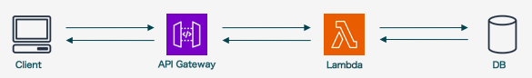

# 3. コンピューティングサービス
## 3.1. AWSにおけるコンピューティングサービス
- コンピューティングサービスはアプリを稼働させるインフラサービスで、システムアーキテクチャの中核を担う
- 扱うサービスは下記の3つ

|サービス|概要|
|---|---|
|EC2|必要な数だけ仮想サーバを立てることができるIaaSサービス ELBやAuto Scaling等のサービスと組み合わせることで動的にサーバ数を変更できる|
|ECS|Dockerコンテナの実行環境を提供するサービス Dockerに関する設定/構築作業を減らすことができる|
|Lambda|プログラムの実行環境を提供するサービス サーバのメンテナンスの必要がないため開発に集中できる|

## 3.2. EC2
- 仮想サーバを提供するサービスで、GUI/CUIで簡単にインスタンスを立てることができる
  - オンプレ環境でサーバを用意する場合、OSのインストール、サーバの調達、ラックの増設、ネットワークや電源の管理といった様々な作業が必要となり、リードタイムが長くなる
  - また、必要な台数、スペック等の見積もりは得てして外れる
- インスタンス数やスペックの変更も簡単に行うことができる
- EC2は`AMI`(Amazon Machine Image)から作成する
  - Amazon Linux AMIや、Red Hat Enterprize Linux、Microsoft Windows Server等AWSが提供しているものや、各ベンダーがサービスをプリインストールしたAMIが存在する
  - 各ユーザがインスタンスの特定断面でAMIを作成することも可能

### 性能
- **インスタンスタイプ**という形でスペックを選択
  - e.g.
    - `m4.large`
    - `p2.8xlarge`
- 先頭の`m`や`p`は**インスタンスファミリー**と呼ばれ、何に最適化しているかを表す
  - e.g.
    - m: 汎用
    - p: 高速コンピューティング
- インスタンスファミリーの後ろの数字は世代を表し、大きいものが最新となる
- xlarge等の部分は**インスタンスサイズ**を表し、大きいほどスペックが高くなる
  - e.g. m4系のインスタンスタイプ(2020/5/2時点)

  ||vCPU|Memory(GB)|
  |---|---|---|
  |m4.large|2|8|
  |m4.xlarge|4|16|
  |m4.2xlarge|8|32|
  |m4.4xlarge|16|64|
  |m4.10xlarge|40|160|
  |m4.26xlarge|64|256|

- ディスクサイズは`EBS`で決まる(EBSについては別章参照)

- EBS最適化オプション
  - EC2では通常の通信で使用するネットワーク帯域とEBSとのやりとりで使用する帯域を共有しているので、ディスクIO、外部とのリクエストが多い場合帯域が足りなくなる
  - EBS最適化オプションを有効化通常のネットワーク帯域とは別にEBS用に帯域を確保できるが、ある程度大きめのインスタンスタイプでしか利用できない

### 費用
- EC2インスタンスには、起動中(Running)、停止中(Stopped)、削除済み(Terminated)の3種類があり、起動しているインスタンスのみが課金対象となる
  - 停止中のインスタンスでもEBSの費用はかかる
- 費用はインスタンスタイプ、リージョン、AMIによって課金される

### スポットインスタンスとリザーブドインスタンス
- 上記の費用についての説明は**オンデマンドインスタンス**という通常の利用形態の場合のもので、他にも**スポットインスタンス**と**リザーブドインスタンス**という利用形態も存在する
- スポットインスタンス
  - AWSが余らせているEC2リソースを入札形式で安く利用できる
  - ただし、余剰リソースがなくなると自動でインスタンスが停止される
- リザーブドインスタンス
  - 長期間(e.g. 1年間)の利用を約束することで割引を受けられる

## 3.3. ELB
- `Elastic Load Balancing`の略で、ロードバランサーのマネージドサービス
- EC2インスタンスをスケールアウトさせる際に、リクエストを分散させるために使用する
  - スケールアウト：システムを構成するサーバーの台数を増やすことで、システムの処理能力を高めること
  - スケールアップ：メモリやHDDの増設や、CPUのスペックアップ等で、サーバーそのもののパフォーマンスを向上させること

### 種類
- 下記の3種類が存在する

|種類|概要|
|---|---|
|CLB(Classic Load Balancer)|L4/L7レイヤーでの負荷分散を行う|
|ALB(Application Load Balancer)|L7レイヤーでの負荷分散を行う CLBよりも機能が豊富|
|NLB(Network Load Balancer)|L4レイヤーでの負荷分散を行う HTTP(S)以外のプロトコルの負荷分散で使用|

- ALBはCLBの後継サービスであり、安価で機能も豊富

### 特徴
- EC2インスタンス上にLBを導入する場合は、そのインスタンスがボトルネックとならないように注意する必要があるが、ELBは**負荷に応じて自動的にスケールする**設定となっている
  - ただしスケーリングは瞬時に完了するわけではなく段階的に行われるため、スパイクには対応不可
  - **ELBプレウォーミング**を申請することで、特定の時間にスケールしている状態とすることができる
- 設定された間隔では以下のインスタンスにリクエストを送り、正常に動作しているかを確認する**ヘルスチェック機能**が存在する
  - 異常とみなされたインスタンスは自動的に切り離され、正常とみなされたタイミングで改めて紐付けられる
  - ヘルスチェック対象ファイル、ヘルスチェック間隔、切り離しの連続失敗閾値、紐付けの連続成功閾値等が設定可能

### Auto Scaling
- システムの利用状況に応じて**自動的にELBに紐づくインスタンス数を増減させる機能**
  - 最小/最大インスタンス数、スケールアウト/イン条件とインスタンス数、スケールイン時に削除するインスタンス条件等が設定可能
- リソース最適化と耐障害性の向上を実現できる
  - e.g. インスタンスの最小/最大数をともに2とした場合、1つのインスタンスで障害が発生すると、そのインスタンスが切り離された後に正常なインスタンスが1つ作成される
- Auto Scalingを導入する際は下記の2点に注意する
  - **サーバをステートレスに設計すること**
    - ファイルアップロード機能を有するアプリで、アップロードされたファイルをサーバに保存してしまうと、スケールインでそのインスタンスが削除されてしまうと参照不可となってしまう
    - データはDBに格納し、ファイルはS3に配置する等の設計を行う必要がある
  - **AZをまたがってインスタンスを配置する**
    - 極稀にAZ全体で障害が発生することがあるため

## 3.4. ECS
- `Elastic Container Service`の略でDockerコンテナ実行環境を提供する

### 特徴
- EC2インスタンス上で実行されるコンテナのことを**Task**と呼び、EC2インスタンスを**Cluster**と呼ぶ
- 1つのCluster上で複数のTaskを実行することができる
- Taskの定義は**Task Definition**で行う
- Taskの役割ごとにTask Definitionを用意し、それを基にCluster上でTaskが起動する
- どのTaskを何個起動させるか、といった設定を**Service**で行うことができる
- 各種概念詳細については[qiitaページ](https://qiita.com/NewGyu/items/9597ed2eda763bd504d7)を参照

### 他のコンテナサービス
- ECS以外にも下記のコンテナサービスが存在する
  - AWS Fargate
    - FargateではEC2を使わずにコンテナを動かすことができる(ECSではCluster用のEC2インスタンスが必要なため、Auto Scalingの設定等インスタンスの管理が必要)
  - Amazon Elastic Container Service for Kubernetes(EKS)
    - Kubernetesはコンテナ管理自動化のためのオープンソースプラットフォーム
  - Amazon Elastic Container Registry(ECR)
    - Dockerを用いる場合、コンテナイメージをレジストリ(ストレージとコンテナント配送サービス)をで管理する必要があり、自前で運用する場合はレジストリの可用性を高める設計が必要となるが、このレジストリをサービスとして提供するのが、ECR

## 3.5. Lambda
- Lambdaサーバーレスでプログラムを実行できるコンピューティングサービス
- ソースコードだけ用意すれば、実行環境は提供される
- リクエスト数に応じて自動でスケールする

### イベント
- Lambda関数という単位で**実行するプログラムとトリガーとなるイベント**を定義する
  - e.g.
    - S3バケットにオブジェクトが追加/削除されたとき
    - DynamoDBテーブルが更新されたとき
    - API GatewayへのHTTPSリクエストがあったとき
    - CloudWatch Eventsによって定義されたスケジューリング実行
  - APIの提供をLambdaで行うパターン
    - API GatewayはURIとHTTPメソッドの組み合わせで呼び出すLambda関数を指定できる

### 設定
- 使用できる言語は下記の通り(2019/3時点)
  - PythonはLambda起動までが早い、Javaは初回起動は遅いが処理は早い等の言語による傾向差異が存在する

  ||
  |---|
  |Node.js|
  |C#|
  |Python|
  |Go|
  |Java|
  |PowerShell|
  |Ruby|

- また、下記の項目の設定を行う必要がある

|項目名|
|---|
|割当メモリ量 **※CPUは割り当てたメモリ量によって決まる**|
|タイムアウト値|
|Lambdaに割り当てるIAMロール|
|VPC内/外での実行|

### 課金体系
- Lambda関数の**実行数**と**実行時間**で料金が決定する
  - 実行数
    - 0.2USD/1,000,000リクエスト
  - 実行時間

  |割当メモリ量(MB)|課金(USD/100ms)|
  |---|---|
  |128|208 * 10^-9|
  |256|417 * 10^-9|
  |512|834 * 10^-9|
  |1024|1667 * 10^-9|
  |2048|3334 * 10^-9|
