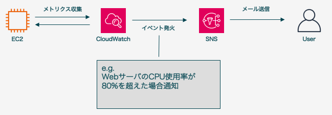

# 4. 運用支援サービス
## 4.1. AWSの運用支援サービス
- **Amazon CloudWatch**は定期的にAWSリソースの状態を取得し、問題がある場合は運用者に通知するサービス
- **AWS CloudTrail**はAWSリソースの作成やマネジメントコンソールへのログイン等の操作記録を行うサービス

## 4.2. CloudWatch
- CloudWatchには下記の3つの機能が存在する
  - CloudWatch
  - CloudWatch Logs
  - CloudWatch Events

### CloudWatch
- CloudWatchでは**メトリクス**と呼ばれる各AWSリソースの状態を定期的に取得することができる
  - EC2インスタンスのCPU使用率、Lambda関数ごとのエラー回数等
- AWSによって予め定義されているメトリクスを**標準メトリクス**と呼ぶ
- 利用者が定義した値をCloudWatchにわたすことで**カスタムメトリクス**を作成することも可能

### CloudWatch Logs
- アプリケーションログやApacheログ等をモニタリングするサービス
- CloudWatch Logsを利用するには独自のエージェントを介してログを収集する
- ログ送信元のインスタンスにはCloudWatch権限を持ったロールを付与する必要がある
- ログ内の特定文言に対してもアラート発報や特定の処理の実行が可能
  - e.g.
    - `[ERROR]`から始まる行が出力された場合
    - `[WARN]`を含む行が一定期間内に3行異常出力された場合

### CloudWatch Events
- トリガーと後続処理を定義することができる
- トリガーのことを**イベントソース**、後続処理を**ターゲット**と呼ぶ
- イベントソースは大きく分けて、**スケジュール**と**イベント**が存在する

|イベントソース|概要|
|---|---|
|スケジュール|時間、期間ベースのトリガー e.g. 3時間毎、金曜の7時|
|イベント|AWSリソースの状態変化のトリガー e.g. Auto Scalingがインスタンス数を増減させた場合|

- ターゲットにはLambda関数をキックする、CodePipelineを実行する等の既存のAWSリソースを指定する
- 1つのイベントソースに対して複数のターゲットを設定することも可能

## 4.3. CloudTrail
- CloudTrailはAWSに関する操作ログを自動で取得するサービス

### 取得できるログの種類
- **管理イベント**と**データイベント**の2種類が取得可能
- **管理イベント**
  - マネジメントコンソールへのログイン、EC2インスタンスの作成、S3バケットの作成等
- **データイベント**
  - S3バケット上のデータ操作、Lambda関数の実行等
- デフォルトでは管理イベントの取得のみが有効となっており、直近90日分のログを確認できる
- 設定を変更することで90日以上過去のログをS3に保管することも可能

### CloudWatch Logsとの連携
- CloudWatch Logsと連携し、特定の操作時に出力される文言を登録することで、不正操作を検知することができる
